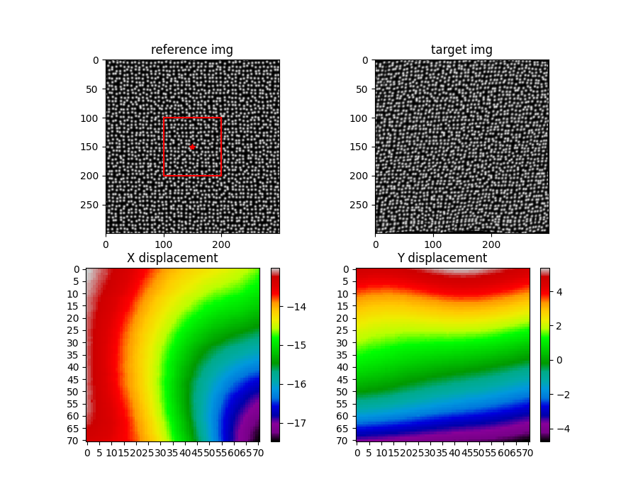

# 介绍
这是一个DIC分析计算的项目，也是我这个苦逼机械人的毕业设计用到的代码（虽然感觉和机械关系不大），希望对阁下有所帮助。    
该项目通过分析比较输入的两幅灰度散斑图像，使用IC-GN算法并结合可靠性引导的计算路径计算得到全局位移场。   
# 用法
见demo.py          
在安装完需要的依赖后，首先读入参考图像和目标图像，经过图像预处理操作后转成二维灰度图，在初始化DIC类的时候传入这两张灰度图。        

    dic = DIC(ref_img, tar_img)  

然后设置参数，其中subset_size代表子区大小，必须是奇数；step指计算点的步长，当步长为1的时候，所有像素点的位移都会被求解。    
  
int_pixel_method指整像素搜索方法，可以选择逐点搜索、粗细搜索、粗细十字搜索、GA、十字搜索、手动给定，这些方法。     

sub_pixel_method指亚像素搜索方法，可以选择IC-GN和IC-GN2，IC-GN2与IC-GN的区别是使用了二阶形函数来表达位移模式。   

ifauto指的是是否自动选择感兴趣的区域和初始点，为1则默认选择图像中心区域 一块矩阵作为感兴趣区域，并以矩形中点作为初始点，为0则需手动选取区域左上角和右上角两点来选择区域，并手动在区域中选择计算初始点。    

    params = {'subset_size': 31,  
             'step': 5,  
             'int_pixel_method': '粗细十字搜索',  
             'sub_pixel_method': 'IC-GN',  
             'ifauto': 1  
             }  
    dic.set_parameters(**params)  

然后就是选择计算区域，因为手动选取的方法是通过matplotlib中的ginput方法来获得坐标位置，所以在需要在调用DIC类中的calculate_points方法时，需要传入几个matplotlib中的对象。   

    fig, ax = plt.subplots(2, 2)  
    fig.set_size_inches(8, 5)  
    ax[0, 0].set_title('reference img')  
    ax[0, 0].imshow(ref_img, cmap='gray')  
    ax[0, 1].set_title('target img')  
    ax[0, 1].imshow(tar_img, cmap='gray')  
    dic.calculate_points(fig, ax[0, 0])  

最后运行，得到结果，result元组中第一项就表达了所有计算点的位移信息，第二项表达了所有匹配点最终的ZNCC系数。 

    result = dic.start()  

将结果绘图，如下

